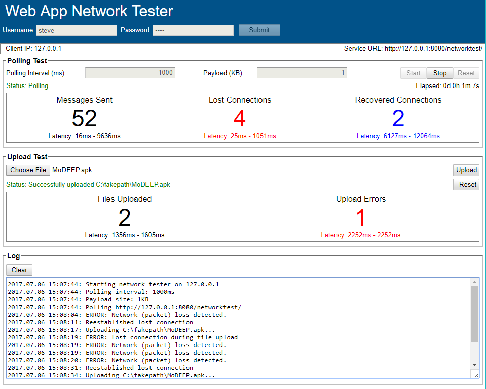

# Web App Network Tester (WANT)

This code tests for network issues between browsers and back-end web service engines. This code differs from similar web browser network analysis tools by polling the back-end using user-defined intervals and payload sizes. In addition, this tester also includes a file-upload feature that allows for testing of large file uploads.

## Installation

Copy ```/deploy/nettester``` to the host and set environment variable
```$NETTESTER_HOME``` to point to directory ```/nettester```.  

Next, copy ```networktest.war``` to the ```$CATALINA_HOME/webapps``` directory used for your existing web applications then restart Tomcat.

To run, point your browser to ```http(s)://[host]/networktest```. 

## Usage



License
----

DHS open source

