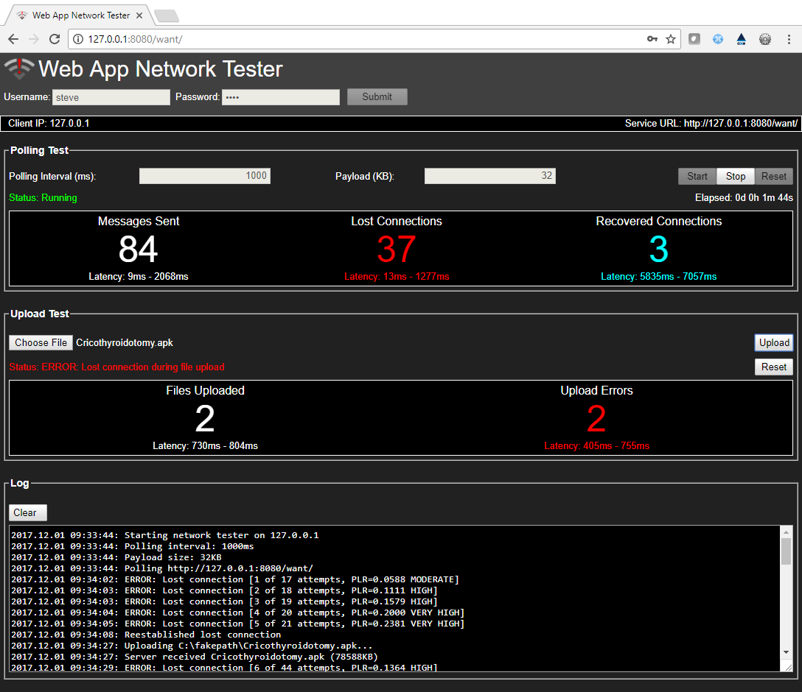

 
# Web App Network Tester (WANT)

The Web App Network Tester (WANT) is a web application that tests for network issues between client browsers and a back-end web service engine (e.g., Apache Tomcat). This code differs from similar web browser network analysis tools by polling the back-end using user-defined intervals and payload sizes. In addition, this tester also includes a file-upload feature that allows for testing of large file uploads. This web application has been used to detect network issues due to various issues including browser cache issues, network proxy issues, as well as network load issues.

## Installation

Copy ```/deploy/nettester``` to the host and set environment variable
```$NETTESTER_HOME``` to point to directory ```/nettester```.  

Next, copy ```networktest.war``` to the ```$CATALINA_HOME/webapps``` directory used for your existing web applications then restart Tomcat.

To run, point your browser to ```http(s)://[host]/networktest```. 

## Screenshot



License
----

DHS open source

